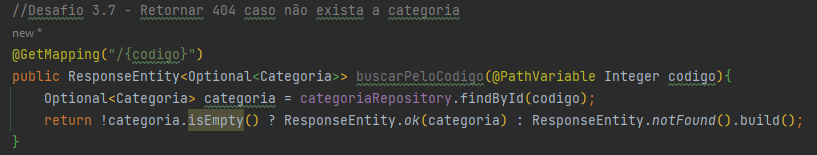
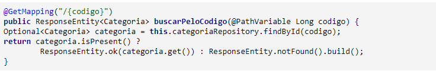
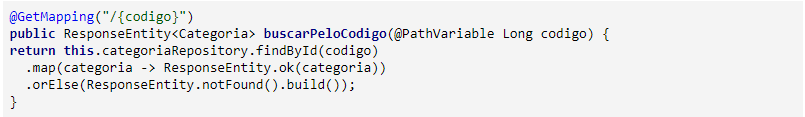
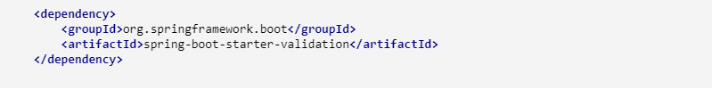
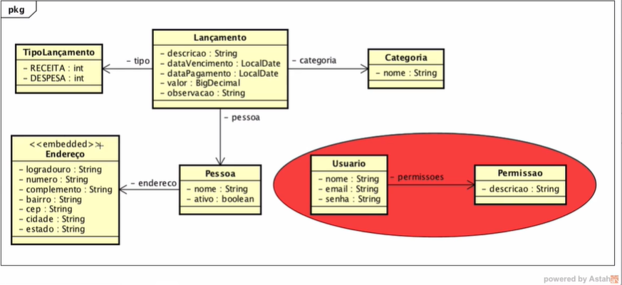
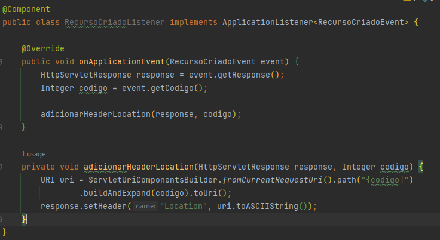

# Fullstack Angular e Spring

<p>Treinamento do curso Fullstack Angular e Spring do AlgaWorks</p>

## Nota para atualização de versões
<p>Este material te guiará na atualização das versões do ambiente de programação necessário para o curso.</p>

## Java JDK 11 ou superior

<p>A versão 2.5.0 do Spring Boot possui compatibilidade com o JDK 8, utilizado nos vídeos. Mas, é indicada a utilização do OpenJDK 11, por ser a versão estável com suporte a longo prazo (LTS - Long Term Support).</p>

<a href="https://adoptopenjdk.net/">Link para download </a>


## Spring Boot
<p>Versão 2.5.0 (configurada na criação do projeto na aula 3.1)</p>

## IDE utilizada
<p>IntelliJ IDEA<p>

## Postman
<a href="https://www.postman.com/downloads/">Link para download </a>

## Banco de Dados
<p>PostgreSQL</p>

# Criando o projeto da API

<p>Este documento irá te auxiliar a fazer esta aula com a versão 2.7.X (por exemplo, 2.7.0) do Spring Boot e suas dependências.</p>

<p>Observação: Este documento é apenas para os que querem usar as versões mais recentes das dependências contidas nesta aula. Ao longo do curso iremos atualizar as dependências, mas caso queira atualizar agora, use este documento como guia.</p>

## Informações

<p>O processo será o mesmo realizado na aula, porém veremos algumas pequenas diferenças nos resultados.</p>

### Na versão 4.11.X do STS (por exemplo, 4.11.0 e em versões superiores), as seguintes dependências tiveram seu nome alterado. 

<ul>
<li>Web -> Spring Web</li>
<li>JPA -> Spring Data JPA</li>
<li>DevTools - Spring Boot DevTools</li>
</ul>

## Maven

<p>Com relação ao maven, algumas poucas diferenças são notadas no arquivo pom.xml gerado:</p>

<li>Versão do Spring Boot</li>

<p>A ferramenta irá sugerir a versão 2.7.X do Spring Boot (por exemplo, 2.7.0).</p>

<pre>
<code>
<span><</span><span>parent</span><span>></span>
    <span><</span><span>groupId</span><span>></span>org.springframework.boot<span><</span><span>/groupId</span><span>></span>
    <span><</span><span>artifactId</span><span>></span>spring-boot-starter-parent<span><</span><span>/artifactId</span><span>></span>
    <span><</span><span>version</span><span>></span>2.7.X<span><</span><span>/version</span><span>></span>
    <span><</span><span>relativePath/</span><span>></span>
    <span><</span><span>/parent</span><span>></span>
</code>
</pre>

<li>Packaging</li>

<p>No arquivo gerado na aula, é criado junto com as informações do projeto, a informação de empacotamento (que no caso, definimos na criação que seria jar).</p>
<p>Nesta versão da ferramenta, esta informação não foi criada, pois jar é a opção default de empacotamento do maven.</p>

<pre>
  <code>
      <span><</span><span>groupId</span><span>></span>com.algaworks.algamoney_api<span><</span><span>/groupId</span><span></span>
      <span><</span><span>artifactId</span><span>></span>algamoney_api<span><</span><span>/artifactId</span><span>></span>
      <span><</span><span>version</span><span>></span>1.0.0-SNAPSHOT<span><</span><span>/version</span><span>></span>
      <span><</span><span>name</span><span>></span><span><</span><span>algamoney_api</span><span>/name</span><span>></span>
      <span><</span><span>description</span><span>></span><span><</span><span>Demo project for Spring Boot</span><span>/description</span><span>></span>
  </code>
</pre>

## Resumo das versões para este caso

<ul>
  <li>Java: 17 LTS</li>
  <li>STS: 4.11.0 LTS</li>
  <li>Spring Boot: 2.7.0 LTS</li>
</ul>

<p>Em geral, estas alterações serão validas para quaisquer versões que você utilizar, desde que seja a mesma ou superior às citadas acima, no nível minor, ou seja, se estiver dentro do 4.11.X (no caso do STS) e 2.7.X (no caso do Spring Boot).</p>


## Atualização do Flyway 8

<p>Devido à atualização da dependência do Flyway para a versão 8 no Spring Boot 2.7.0, é necessário adicionar uma dependência a mais do Flyway, dependendo do banco de dados utilizado.</p>

<p>Caso utilize o MySQL, adicione:</p>
<pre>
  <code>
      <span><</span><span>dependency</span><span>></span>
          <span><</span><span>groupId</span><span>></span>com.algaworks.algamoney_api<span><</span><span>/groupId</span><span></span><span>></span>
          <span><</span><span>artifactId</span><span>></span>algamoney_api<span><</span><span>/artifactId</span><span>></span>
      <span><</span><span>/dependency</span><span>></span>
  </code>
</pre>

### A tabela schema_version
<p>No Spring 2.5.0, o Flyway é instalado na versão 7.9.1. Nesta versão, a tabela schema_version, gerada de forma automática, aparece com o nome flyway_schema_history.</p>


# Desafio 3.7 : Retornar 404 caso não exista a categoria

## Minha Resolução

<p>Minha resolução no momento do desafio</p>

### Utilizando isPresent()


<p>Esta sugestão é bem parecida com a resolução da própria aula, porém ao invés de ficarmos checando manualmente de objeto é null ou não, o Optional nos dá algumas facilidades.</p>
<p>Neste caso utilizamos o método isPresent, que nada mais é que uma comparação “obj != null”, e finalizamos com um ternário, igual a resolução da aula.</p>

### Utilizando o Map


<p>Neste exemplo, fizemos a chamada ao método findById que nos retornou um Optional do tipo Categoria.</p>
<p>Usamos o método map, para transformar o objeto que foi retornado como Optional (isso é feito caso o mesmo não seja null), depois retorna o objeto transformado em Optional novamente.</p>
<p>Como o retorno do próprio map também é um Optional, podemos utilizar o método orElse, para retornarmos notFound, como mostrado na imagem acima.</p>

# 3.10 Validando valores inválidos com Bean Validation

<p>O Hibernate Validator não é mais adicionado como dependência no spring-boot-starter-web. É necessário adicionar a dependência spring-boot-starter-validation para utilizar as validações @NotNull</p>

 
 
# Desafio: 3.11 - Criando o cadastro de pessoa

## Diagrama


<p>Cadastrar 10 pessoas</p>


# 3.12. Usando eventos para adicionar header Location

Revisão e correção de bugs.

## Usando eventos para adicionar header Location

<p>Para resolver um problema de código duplicado nas classes PessoaResource e CategoriaResource.</p>
<p>Toda vez que o dev quiser adicionar o header Location, um método irá disparar um evento </p>

<p> Criei uma classe RecursoCriadoEvent no pacote event que extende a AplicationEvent</p>
<p> Criei uma classe (que é o listener do evento e que precisa ser anotado como Component) RecursoCriadoListener no pacote listener que implementa a AplicationListener</p>
<p> Nesta classe do listener, implementado o método onApplicationEvent</p>




# 4.4. Implementando atualização parcial com PUT

Revisão e correção de bugs.

# 5.3. Desafio: Cadastrando o primeiro lançamento

Revisão e correção do desafio.

# 5.6. Regra para não salvar pessoa inativa

Revisão e correção de bugs.

# 5.7 - Atualização da dependência JPA Modelgen
<p>No vídeo foi utilizada a versão 5.0.12.Final da dependência hibernate-jpamodelgen. A versão adequada para o Spring 2.7.X é a 5.6.9.Final. Para fazer o download desta versão basta adicionar a seguinte dependência no pom.xml</p>

<pre>
  <code>
      <span><</span><span>dependency</span><span>></span>
          <span><</span><span>groupId</span><span>></span>org.hibernate<span><</span><span>/groupId</span><span></span><span>></span>
          <span><</span><span>artifactId</span><span>></span>hibernate-jpamodelgen<span><</span><span>/artifactId</span><span>></span>
          <span><</span><span>scope</span><span>></span>provided<span><</span><span>/scope</span><span>></span>
      <span><</span><span>/dependency</span><span>></span>
  </code>
</pre>

<p>A configuração mostrada na aula para o STS continua igual.</p>

## Método isEmpty da biblioteca StringUtils

<p>O método isEmpty da bilbioteca StringUtils foi depreciado. É aconselhável utilizar o método de mesmo nome da bilblioteca ObjectUtils.</p>
<pre>
  <code>
      if(!ObjectUtils.isEmpty(lancamentoFilter.getDescricao())) {
    predicates.add(builder.like(
            builder.lower(root.get(Lancamento_.descricao)), "%" + lancamentoFilter.getDescricao().toLowerCase() + "%"));
}
  </code>
</pre>

### Observação
<p>Não foi possível utilizar os recursos do metaModel no IntelliJIDEA, por isso, optei utilizar a string mesmo. A utilização do metaModel é só para não errar nas strings, sendo assim, não é uma propriedade obrigatória</p>

<p>A importação deve ser feita com o seguinte comando:</p>

<pre>
  <code>
    import org.springframework.util.ObjectUtils;
  </code>
</pre>

## Resolução de bug da aula 5.7

A filtragem de data não estava dando certo.  
O problema está na linha onde estava tentando acessar root.get("dataVencimentoDe") e root.get("dataVencimentoAte"). No entanto, esses atributos não existem diretamente na entidade Lancamento, pois pertencem ao filtro LancamentoFilter.

✅ Resolveu após alterar para "dataVencimento". Os atributos em LancamentoFilter, servem para serem usados de parâmetros na url.

# Problema com o Manifest.txt

<p>Acontece que o arquivo jar fica localizado na pasta "target". Sendo assim, estando na pais raiz do projeto, passe o nome da pasta targe junto ao nome do arquivo jar usar o seguinte comando:</p>

<pre>
     java -jar "./target/algamoney_api-0.0.1-SNAPSHOT.jar --spring.datasource.username= --spring.datasource.password=root"
</pre>

# 5.8. Desafio: Removendo lançamentos

Implementado uma melhoria no método.

# 6.3. Implementando segurança com OAuth 2 e Password Flow

### Nota Importante sobre a depreciação do Spring Security OAuth2

As aulas deste módulo utilizam o projeto do Spring Security OAuth2, que se encontra depreciado. Para fins didáticos, neste momento, recomendamos que continue utilizando esse projeto na sua última versão disponível, ele irá ajudar a entender diversos conceitos do OAuth2.

### Sobre o novo Spring Authorization Server
No módulo 25, utilizaremos o Spring Authorization Server, o substituto do Spring Security OAuth2, utilizando todos os conceitos aprendidos aqui. É muito imporante concluir este módulo primeiro

1. Sobre a aula
2. pom.xml
Será necessário adicionar ao pom.xml as dependências referentes ao Resource Server do Spring e à utilização do token opaco (Opaque Token).

Outra alteração recomendada é a atualização de spring-security-oauth2 para a versão 2.5.1.RELEASE

```
<dependency>
    <groupId>org.springframework.security.oauth</groupId>
    <artifactId>spring-security-oauth2</artifactId>
    <version>2.5.1.RELEASE</version>
</dependency>

<dependency>
    <groupId>org.springframework.boot</groupId>
    <artifactId>spring-boot-starter-oauth2-resource-server</artifactId>
</dependency>

<!-- Necessário para o funcionamento do Opaque Token -->
<dependency>
    <groupId>com.nimbusds</groupId>
    <artifactId>oauth2-oidc-sdk</artifactId>			
    <version>9.37.2</version>
    <scope>runtime</scope>
</dependency>

```

# Sobre Autenticação e Autorização com Spring Security e JWT Tokens

A Fernanda Kipper ensina a trabalhar com Autenticação e Autorização, [ver mais clicando aqui.](https://www.youtube.com/watch?v=5w-YCcOjPD0)

# Autenticação e Autorização com Spring Security e JWT Tokens - Fernanda Kipper

Implementação da segurança de acordo com video aula de Fernanda Kipper.


## Usando JWT

### Criando serviço para gerar Token JWT

# 6.12. Adicionando permissões de acesso

## 1. Sobre a aula
Para essa aula, precisaremos fazer algumas adaptações em nosso código para que ele possa funcionar

## 2. CategoriaResource
Devido á nova stack de segurança do Spring Security a expressão "#oauth2.hasScope" não é mais utilizada. No seu lugar vamos utilizar a expressão "hasAuthority", informando um escopo específico, exemplo: hasAuthority('SCOPE_read').

```
@RequestMapping("/categorias")
public class CategoriaResource {

	@Autowired
	private CategoriaRepository categoriaRepository;

	@Autowired
	private ApplicationEventPublisher publisher;
    
        @GetMapping
        @PreAuthorize("hasAuthority('ROLE_PESQUISAR_CATEGORIA') and hasAuthority('SCOPE_read')" )
        public List<Categoria> listar() {
        	return categoriaRepository.findAll();
        }
    	
	@PostMapping
        @PreAuthorize("hasAuthority('ROLE_CADASTRAR_CATEGORIA') and hasAuthority('SCOPE_write')")
	public ResponseEntity<Categoria> criar(@Valid @RequestBody Categoria categoria, HttpServletResponse response) {
		Categoria categoriaSalva = categoriaRepository.save(categoria);
		
		publisher.publishEvent(new RecursoCriadoEvent(this, response, categoriaSalva.getCodigo()));

		return ResponseEntity.status(HttpStatus.CREATED).body(categoriaSalva);
	}

    	@GetMapping("/{codigo}")
    	@PreAuthorize("hasAuthority('ROLE_PESQUISAR_CATEGORIA') and hasAuthority('SCOPE_read')")
    	public ResponseEntity<Categoria> buscarPeloCodigo(@PathVariable Long codigo) {
        	Optional<Categoria> categoria = categoriaRepository.findById(codigo);

        	return categoria.isPresent() ? ResponseEntity.ok(categoria.get()) : ResponseEntity.notFound().build();
    	}
    
}
```

# 6.13. Desafio: Finalizando permissões de acesso

O teste da implementação não está dando certo. 
Mesmo o usuário não tendo permissões para alterações, o usuário mesmo ainda assim consegue. 
Necessário analisar o problema.

# Deploy da API

## 7.1. Implementando projeção de lançamento

Essa funcionalidade é para retornar apenas informações que o cliente exemplo precisa. 
Criamos uma classe ResumoLancamento. Esta classe contém apenas os getters e setters e o construtor com todos os atributos no parâmentro.

## 7.2. Profiles do Spring

### 1. Configuração da classe AlgamoneyApiProperty
É necessário adicionar a anotação @Component na classe AlgamoneyApiProperty. O bean injetado nas classes Token Resource, RefreshTokenPostProcessor e CorsFilter depende dessa configuração, que não é mais realizada automaticamente apenas com a anotação @ConfigurationProperties

### 2. Alteração em AlgamoneyApiApplication
Não é mais necessário colocar a anotação EnableConfigurationProperties em AlgamoneyApiApplication, logo, a seguinte linha de código pode ser removida:

```
@EnableConfigurationProperties(value = AlgamoneyApiProperty.class)
```